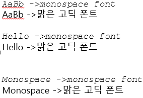

# 20190501 2주차 학습 정리

## 1. monospace font란?
- 고정길이 폰트로 개발자를 위한 폰트이다.


- 맑은고딕과 monospace 폰트를 비교했을때 monospace 폰트가 각 글자마다 일정한 간격을 유지하는것을 볼 수 있다.

## 2. semantic tag란?

- semantic : 의미의, 의미론적이라는 뜻이다.
- ```<div>```와 같은 태그는 non-semantic태그라 할 수 있고 
  ```<aside>, <section>,<header>, <footer>, <nav>, <article>``` 등의 태그는 semantic 태그라고 할 수있다.
- ```<div>``` 태그만 볼때 이 태그 안에 들어간 내용의 의미를 알 수 없지만
  ```<aside>, <article>```과 같은 태그는 안에 들어갈 내용의 의미를 유추할 수 있다.
### 2-1. semantic 태그를 이용하는 이유?
- 검색엔진이 html 파일을 분석할 때 정확하게 컨텐츠를 식별하기 위해 정해진 semantic tag를 사용하기로 규약을 정하였다.
(검색엔진들이 semantic web을 좋아한다.)

## 3. HTML의 형태
- ```<tag name attribute name ="attribute value"> </tag name> ```  
- 예시: ```<h2 style="color:hotpink;background-color:purple;display:inline-block" class="green orange">aaaa</h2>```

## 4. block element, in-line element
### 4-1. block element
- block element에는 ```<p>```가 있다. -> paragraph의 약자.
- 한 줄을 다 차지 한다. 
- 기본적으로 가로폭 전체의 넓이를 가지는 직사강형 형태가 되며
  width, height, margin, padding 등을 사용하며 크기를 변형시킬 수 있다.
  그리고 block element 다음에는 줄바꿈이 이루어진다.
  (al, ul, div, h1 태그 등이 있다.)
### 4-2. in-line element
- inline element에는 <span>이 있다. -> 한 뼘을 의미함.
- 한 문장 단위를 끊을 때 사용하며 컨텐츠 크기만큼만 차지 한다.</br>
  그래서 임의로 width, height 크기를 변형시킬 수 없다.
- 그리고 inline element 다음에는 줄바꿈이 없고 우측으로 바로 이어서 표시된다.
  (img, var, span, a 태그 등이 있다.)

  
  