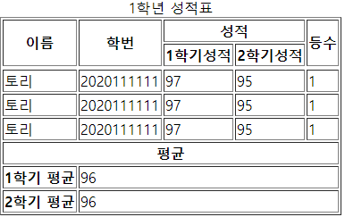

# 20190518 4주차 학습 정리

## 1-1. table tag
- table을 만들기 위해 제일 먼저 사용하는 tag
- 사용 방법 : ```<table border="1">```
- border는 표의 테두리 두께를 결정하는데, 숫자가 클 수록 두께가 두꺼워진다.

## 1-2. tr tag
- table row의 약자.
- 가로줄을 만드는 역할을 한다.
- 사용 방법 : `<tr>`내용`</tr>`

## 1-3. th tag
- table head의 약자.
- 글씨체는 bold체로 나온다.
- 표의 제목을 만드는 역할을 한다.
- 사용 방법 : `<th>`내용`<th>`

## 1-4. td tag
- table data의 약자.
- 셀을 만드는 역할을 한다.
- 사용 방법 : `<td>`내용`</td>`

## 1-5. caption 
- table의 제목을 표현한다.
- 표에 대한 설명이다.
- 사용방법 : ```<caption> 1학년 성적표 </caption>```

## 1-6. colgroup
- col의 집합이다.
- 각 columm의 길이를 지정할 때 주로 사용한다.
- 사용방법 :  ```<colgroup>  <col/>  <col/>  <col span="2"/>  </colgroup>```

## 1-7. colspan
- columm span의 약자. 행을 의미한다.
- 가로줄을 합칠 때 사용한다.
- 사용방법 :``` <th colspan="2" scope="colgroup">성적</th> ```
- 숫자는 합치는 셀의(가로줄) 개수를 의미한다.

## 1-8. rowspan
- 세로줄을 합칠 때 사용한다. 열을 의미한다.
- 사용방법 : ```<th rowspan="2" scope="col">이름</th>```
- 숫자는 합치는 셀의(세로줄) 개수를 의미한다.

## 1-9. thead
- 표의 머리 부분.
- 표에서 한 번만 사용할 수 있다.
- tbody나 tfoot보다 먼저 선언되어야 한다.

## 1-10. tbody
- 표의 본문 부분.
- 표에서 여러번 사용이 가능하다.

## 1-11. tfoot
- 표의 하단 부분.
- 표에서 한 번만 사용할 수 있다.
- tbody 보다 먼저 작성해도 표의 맨 마지막 부분에 위치하게 된다.

## 1-5. 사용 예시
```<!DOCTYPE html>    
<html lang="en">    
<head>    
    <meta charset="UTF-8">
</head>
<body>
<table border="1">
    <caption>1학년 성적표</caption>
    <colgroup>
        <col/>
        <col/>
        <col span="2"/>
    </colgroup>
    <thead>
    <tr>
        <th rowspan="2" scope="col">이름</th>
        <th rowspan="2" scope="col">학번</th>
        <th colspan="2" scope="colgroup">성적</th>
        <th rowspan="2" scope="col">등수</th>
    </tr>
    <tr>
        <th scope="col">1학기성적</th>
        <th scope="col">2학기성적</th>
    </tr>
    </thead>
    <tbody>
    <tr>
    <tr>
        <td>토리</td>
        <td>2020111111</td>
        <td>97</td>
        <td>95</td>
        <td>1</td>
    </tr>
    <tr>
        <td>토리</td>
        <td>2020111111</td>
        <td>97</td>
        <td>95</td>
        <td>1</td>
    </tr>
    <tr>
        <td>토리</td>
        <td>2020111111</td>
        <td>97</td>
        <td>95</td>
        <td>1</td>
    </tr>
    </tbody>
    <tfoot>
    <tr>
        <th scope="rowgroup" colspan="5">평균</th>

    </tr>
    <tr>
        <th scope="row">1학기 평균</th>
        <td colspan="4">96</td>
    </tr>

    <tr>
        <th scope="row">2학기 평균</th>
        <td colspan="4">96</td>
    </tr>
    </tfoot>
</table>
</body>
</html>
```
## 1-6. 결과값



