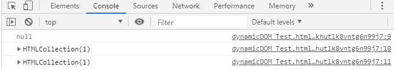
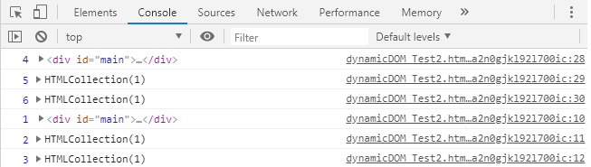
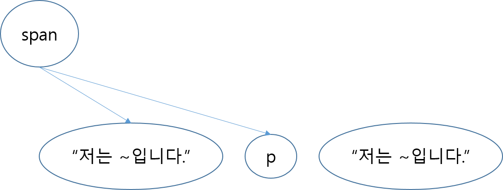

# 20190616 6주차 학습 정리

## event listener의 역할
- 어떠한 event가 발생했을때(마우스클릭, 스크롤 등) 실행시킬 함수를 호출해준다.

## body tag 맨 아래쪽에 script tag가 위치하는 이유

DOM Tree가 모두 생성되기 전에 DOM에 접근할 경우 해당하는 객체가 없을 때 오류가 난다.

### 예시
```html
<body>
<script>
console.log(document.getElementById("main"));
console.log(document.getElementsByTagName("body"));
console.log(document.getElementsByTagName("head"));
</script>
<div id="main">
    <div class="text-container">
        <span>저는 span입니다.</span>
        <p>저는 p입니다.</p>
    </div>
    <div class="image-container">
        
    </div>
</div>
<div class="text-container">

</div>
</body>
```
### 결과


script tag 위 쪽에 있는 객체들은 참조가 가능하지만 아래 쪽에 있는 객체들은 참조가 불가능하다.

### 해결방안
위 의 현상을 다음과 같이 해결할 수 있다. 
```html
<body>
<script>
    window.onload = function () {
        console.log(1,document.getElementById("main"));
        console.log(2,document.getElementsByTagName("body"));
        console.log(3,document.getElementsByTagName("head"));
    }
</script>
<div id="main">
    <div class="text-container">
        <span>저는 span입니다.</span>
        <p>저는 p입니다.</p>
    </div>
    <div class="image-container">
        
    </div>
</div>
<div class="text-container">

</div>
<script>
    console.log(4,document.getElementById("main"));
    console.log(5,document.getElementsByTagName("body"));
    console.log(6,document.getElementsByTagName("head"));
</script>
</body>
```
- onload event를 활용하는 방법
```html
<head>
<script>
    window.onload = function () {
        console.log(1,document.getElementById("main"));
        console.log(2,document.getElementsByTagName("body"));
        console.log(3,document.getElementsByTagName("head"));
    }
</script>
</head>
```
- body의 맨 하단에 script를 위치 시키는 방법
```html
<body>
...
<script>
    console.log(4,document.getElementById("main"));
    console.log(5,document.getElementsByTagName("body"));
    console.log(6,document.getElementsByTagName("head"));
</script>
</body>
```
### 결과


- 결과는 위에서 부터 순차적으로 출력되는 것이 아니라 4,5,6,1,2,3 순으로 출력되었음.
(event loop)


## 동적 DOM 구성 방법
### DOM 접근 방법

1. elements가 붙은 메서드들은 반환값이 리스트이다
```javascript
document.getElementsByTagName("body");
``` 
=> `[<body>]`
2. element에 접근하려면 index로 접근해야한다.
```javascript
document.getElementsByTagName("body")[0];
```
=> `<body>`
3. 반환 값은 변수로 handling 가능하다.
```javascript
var test = document.getElementsByTagName("body");
test[0]
```
=> `<body>`

### DOM을 추가하는 방법

- 요소.appendChild(요소)

#### 예시
```javascript
var span = document.createElement("span");
span.appendChild(document.createTextNode("저는 text-container입니다."));
span.appendChild(document.createElement("p"));
document.createTextNode("저는 text-container입니다.");
```

#### dom-tree



- 요소.insertBefore(요소)

#### 예시
```javascript
var beforeExampleElement = document.createElement("span");
beforeExampleElement.appendChild(document.createTextNode("비포이그젬엘리먼트"));
document.getElementById("main").insertBefore(beforeExampleElement,textContainer[0]);
```
[예시소스 링크](https://github.com/eunhynugkim/web-study/blob/master/20190616/dynamicDOM_Test3.html)
