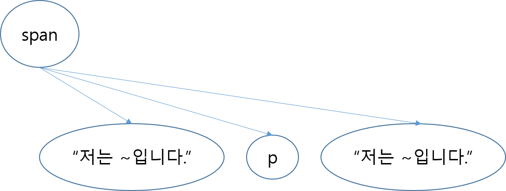

# 20190616 6주차 학습 정리

## event listener의 역할
- 어떠한 event가 발생했을때(마우스클릭, 스크롤 등) 실행시킬 함수를 호출해준다.

## body tag 맨 아래쪽에 script tag가 위치하는 이유
- DOM Tree가 모두 생성되기 전에 DOM에 접근할 경우 해당하는 객체가 없을 때 오류가 난다.

## 동적 DOM 구성 방법
```
1. document.getElementsByTagName("body");
2. document.getElementsByTagName("body")[0];
3. var test = document.getElementsByTagName("body");
test[0]
```
## 결과
### 1.`[<body>]`
### 2.`<body>`
### 3.`<body>`


## dom-tree
```
var span = document.createElement("span");
span.appendChild(document.createTextNode("저는 text-container입니다."));
span.appendChild(document.createElement("p"));
document.createTextNode("저는 text-container입니다.");
```
## 결과 



